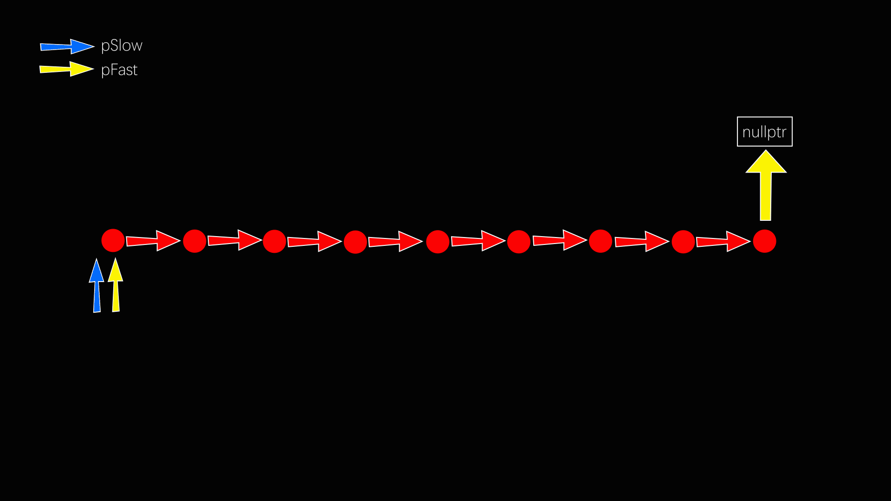
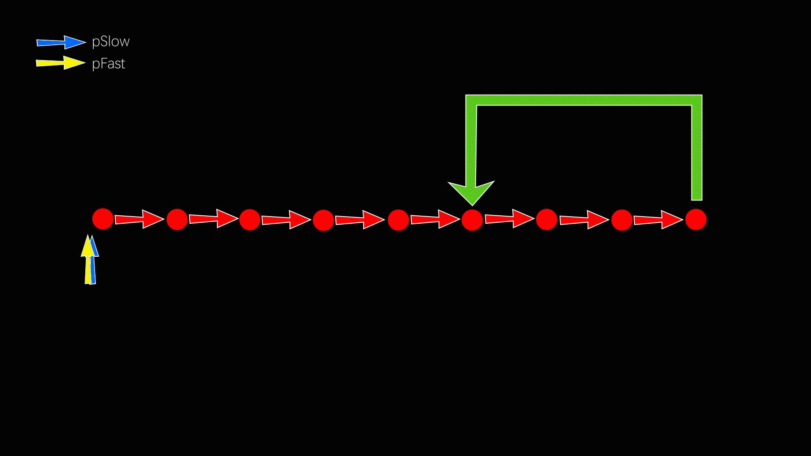

# Three Method to judge whether a list has cycle

## 1. Using Two Pointers

Two pointers, one is pSlow, the other is pFast.  
The pSlow moves 1 step, the pFast moves 2 steps(if pFast->next is nullptr, then pFast = nullptr).  
When pSlow is equal to pFast, there is cycle in list.  
If pFast is nullptr, there is no cycle in list.  
Animation:  
When there is no cycle in list:  
  
When there has cycle in list:
  

Prove:  

Performance:  
Time: $O(n)$
Space: $O(1)$

## 2. Using Hashmap

Time: $O(n)$
Space: $O(n)$

## 3. By Redirecting the node->next to Self

Time: $O(n)$
Space: $O(1)$
